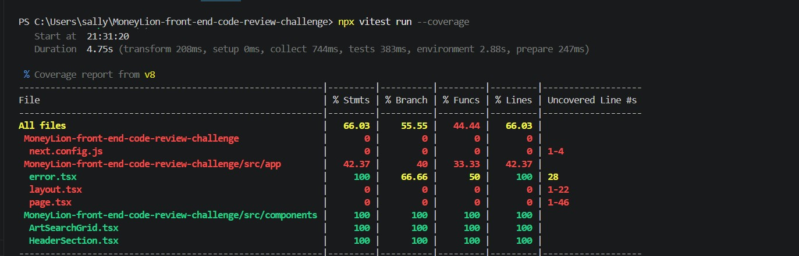

# MoneyLion Front-End Code Review Challenge

This repository contains the solution and code review improvements for the Senior Frontend Engineer (AI-Augmented) technical challenge.

## 🚀 What We've Done & Improvements Made

### 1. Code Splitting & Component Architecture
* Refactored the monolithic `page.tsx` into clean, reusable, and modular components:
  * **HeaderSection.tsx:** Handles the top description and branding elements with robust accessibility.
  * **ArtSearchGrid.tsx:** Manages the main card grid layout, semantic sections, and a11y labels.

### 2. Robust Error Handling
* Implemented a dedicated Next.js App Router **Error Boundary (`error.tsx`)** featuring a custom, high-end fallback UI and reset mechanism.
* *Reviewer Testing Note:* A commented-out test error is placed in `page.tsx` for quick verification.

### 3. Accessibility (a11y) & Semantic Structure
* Integrated semantic HTML tags (`<section>`, `<header>`) and explicit `aria-label` attributes across interactive elements.
* Handled external links securely with `target="_blank"` and `rel="noopener noreferrer"`.

### 4. Styling & UI Fixes
* Cleaned up and optimized `page.module.css`.
* Restored original Next.js responsive design and layout for both Desktop and Mobile views.

### 5. Testing & Quality Assurance
* Implemented comprehensive Unit Tests using Vitest and React Testing Library covering components and the error boundary.
* Organized test files cleanly inside the project structure.

---

## 📊 Test Coverage Report

Here is the test coverage report showing our test cases and code coverage:

---

## 👤 Author & Reviewer

* **Developer:** Sali Samir (Senior Frontend Engineer / Frontend Lead)
* **Code Reviewer / Contact:** Jerome Dane (https://github.com/jeromedane)
